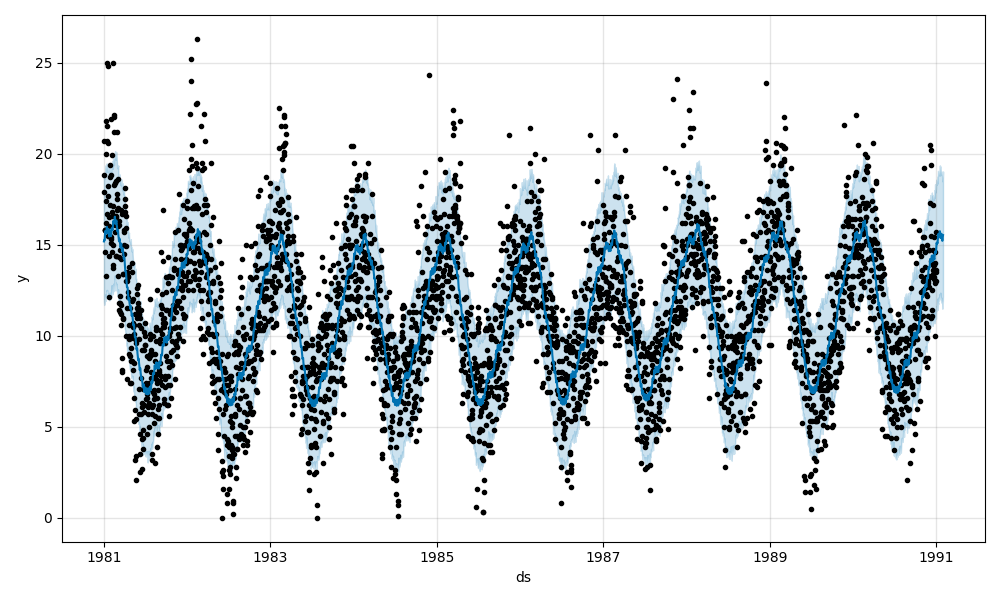
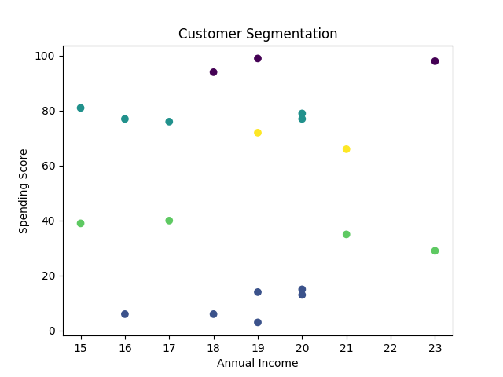
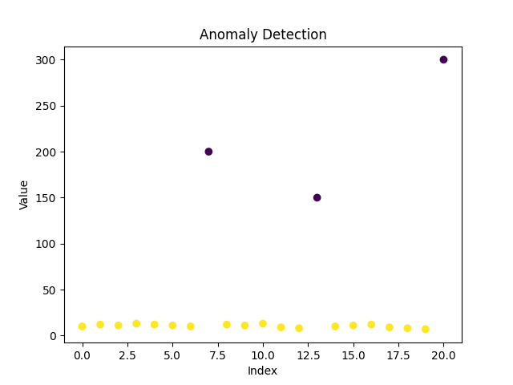

# 👋 Hi, I'm Rebin
Passionate about solving real-world problems using data-driven insights.

🎯 Data Analyst | Data Science Graduate

---

## 📊 Projects

### 📈 Demand Forecasting

* Built time-series forecasting model using Prophet
* Captured seasonal trends and generated 30-day forecasts
* Supported demand planning and inventory decision-making

---

### 👥 Customer Segmentation

* Applied K-Means clustering to segment customers
* Identified 5 distinct behavioral groups
* Enabled targeted marketing and customer strategy

---

### 🚨 Anomaly Detection

* Built Isolation Forest model to detect anomalies
* Identified extreme values (~10–15% outliers)
* Improved operational data quality monitoring

---

## 🛠 Skills

Python | SQL | Pandas | Machine Learning | Data Analysis

---

## 📫 Contact

Email: [rebinfathah@gmail.com](mailto:rebinfathah@gmail.com)
